# Project-management-system

- Thesis project for **Computer Science BSc**
- Author: **Dorkó Arnold**

## Abstract

This is my final year project for Computer Science BSc thesis.

## Project details

- Backend: **.NET Core 6 Web API**
- Frontend: **React Typescript (vite.js)**

## Database structure

## Project description

The goal of this application is to create a **project management system** where you can **manage** your projects and **invite** others to your **projects** to **share** the **workflow**.

- User authentication/authorization
- Project
  - Create, delete, modify project
  - Manage project people
- Project kanban board
  - Add, remove column
  - Edit column position
  - Rename column title
  - Add, remove issues
  - Filter issues by title, date, priority etc...
  - View issue details
- Tasks
  - View your tasks by selecting the project
  - Click on task to navigate kanban table and open modal with issue details
  - Filter issues...

- Statistics
  - Gantt-chart (issues)
  - Distribution of tasks by state
  - Distribution of tasks by reporter
  - Distribution of tasks by priority
  - Distribution of tasks by assigned people
  - Distribution of tasks by issue type
  - Recent project activity (audit log)
- User page
  - View current user details
  - Change password
  - Change language
- Themes
  - Light theme
  - Dark theme

## Project images

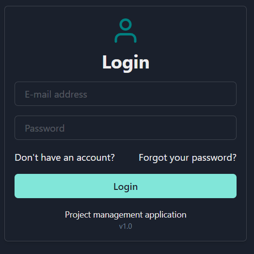

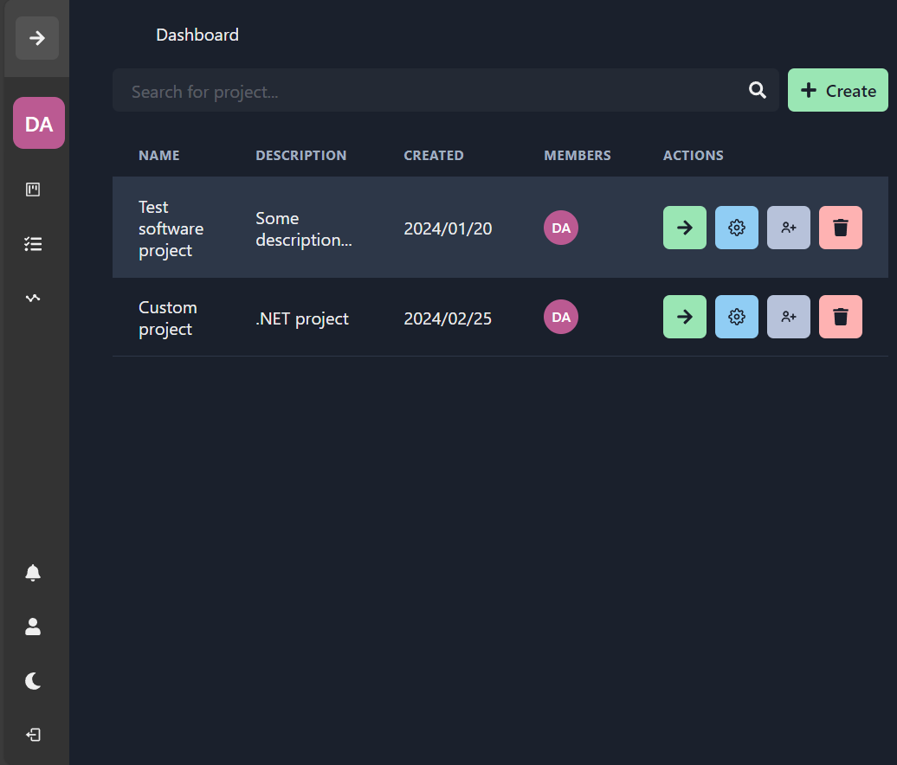

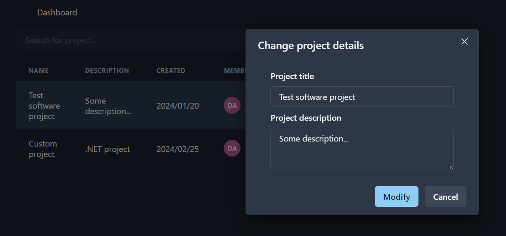

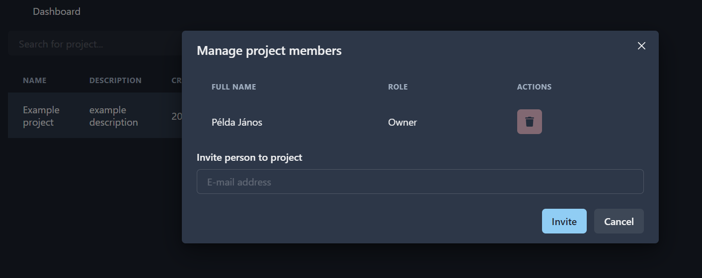

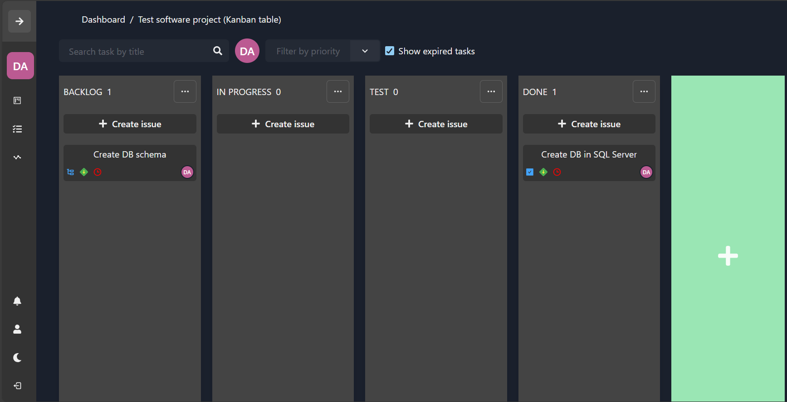

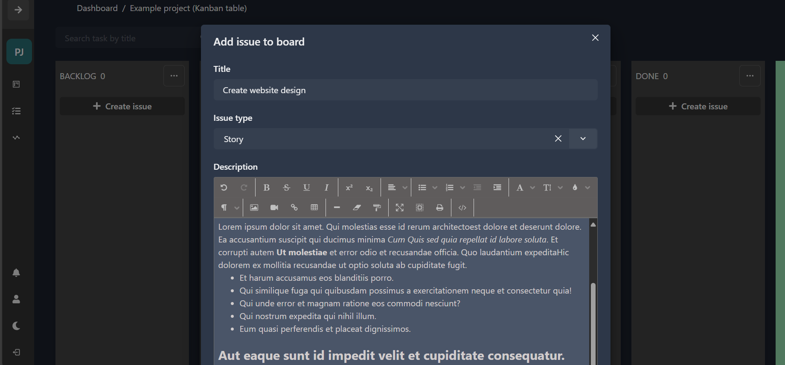

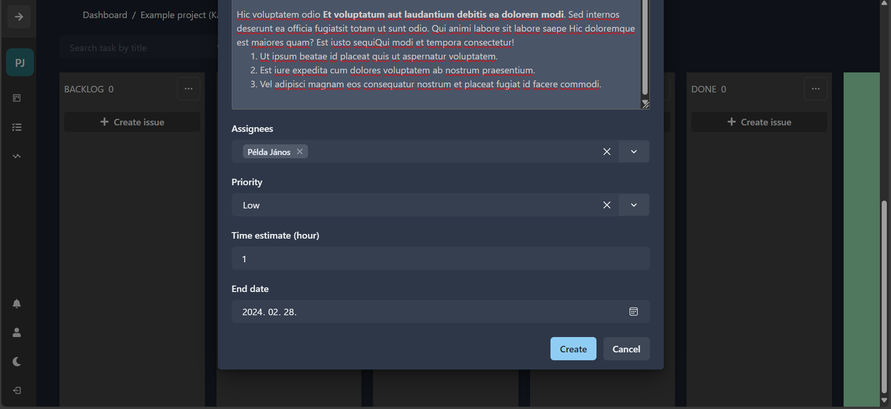

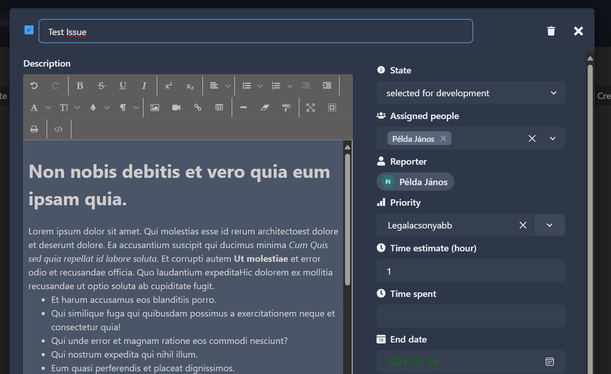

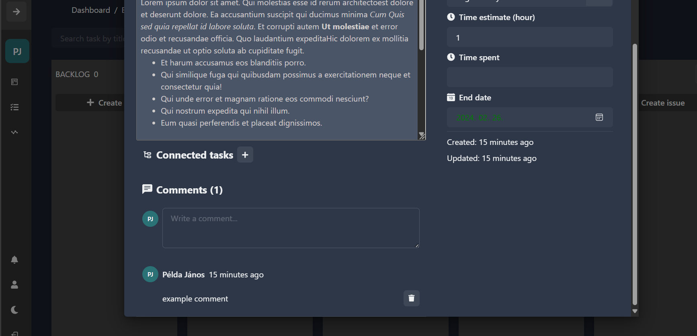

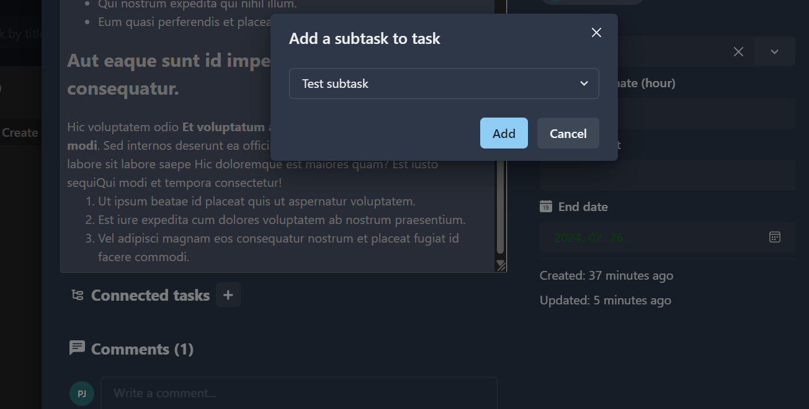

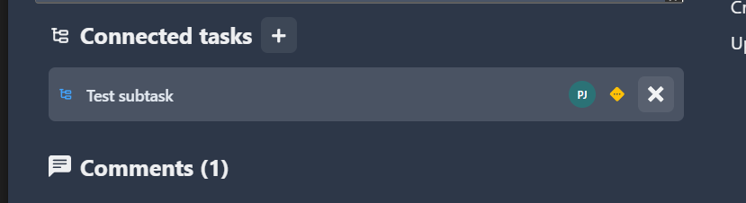

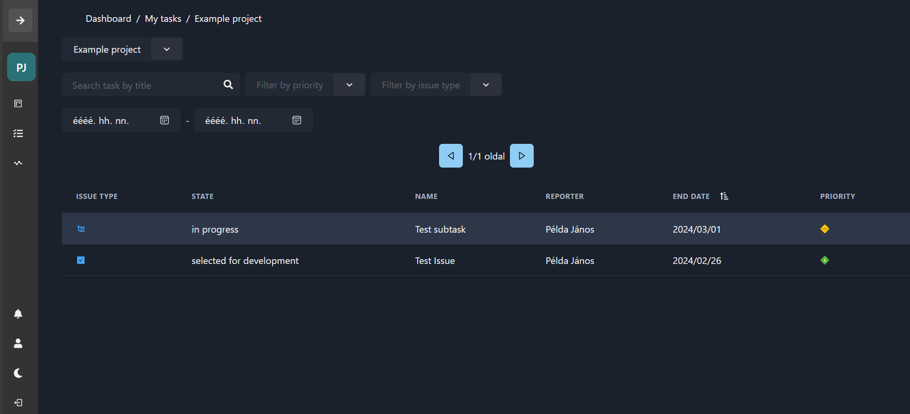

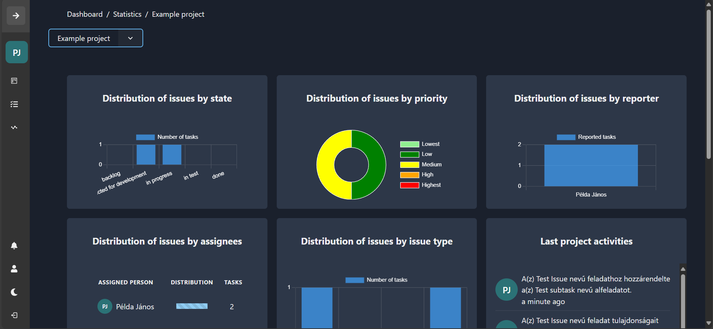

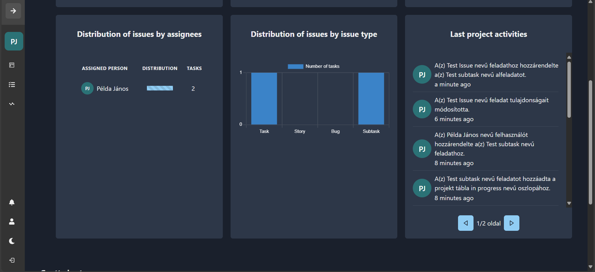

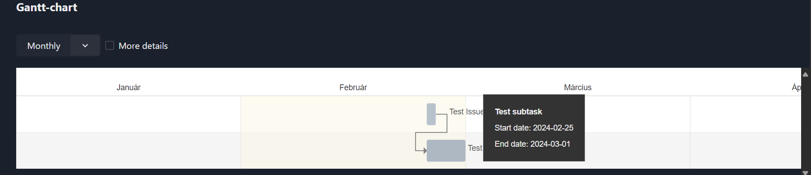

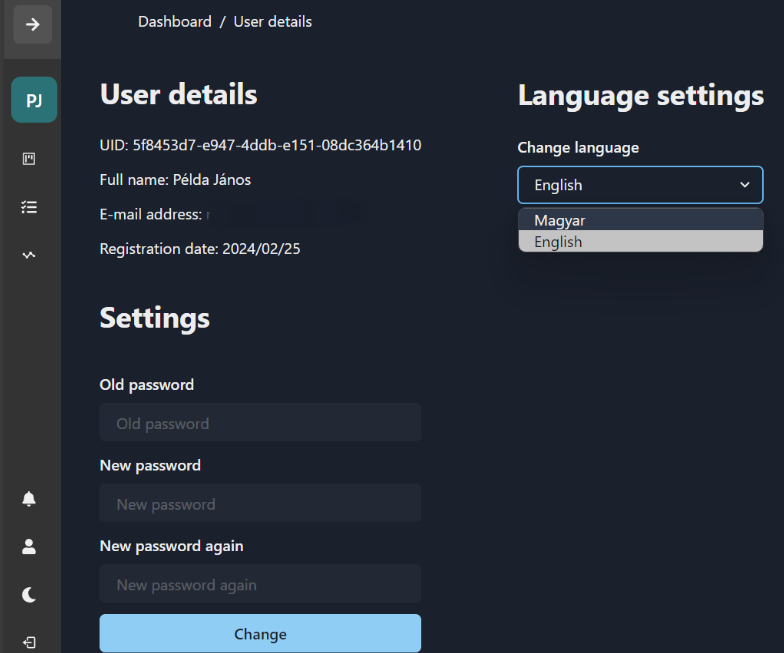

## How to deploy application (IIS)

1. Install SQL Server Management Studio 19
2. Install Internet Information Services Manager 10
3. Open SSMS then run
`db_schema.sql` in database and grant SQL access to LocalSystem
4. Download `wwwroot.zip` from Releases and unzip into `C:\inetpub\wwwroot` folder
5. Create new site in IIS and new application pool in IIS
(application pool name: Szakdolgozat_backend, .NET CLR version: No managed code, managed pipeline mode: integrated, identity: LocalSystem)
6. Create new application pool in IIS Manager
7. Add new application to `Default Web Site` and select the previous created application pool (path: C:\inetpub\wwwroot\api, application pool: Szakdolgozat_backend)
8. Application should be available at `localhost:80`
